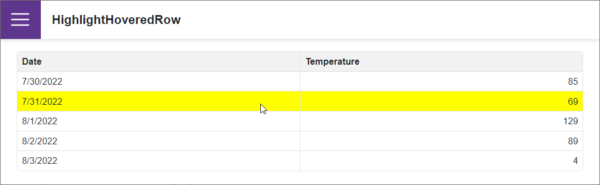

# Grid for Blazor - How to highlight a row on hover

This example demonstrates how to highlight a [DxGrid](https://docs.devexpress.com/Blazor/403143/grid) row when a user hovers over the row.

The [CustomizeElement](https://docs.devexpress.com/Blazor/DevExpress.Blazor.DxGrid.CustomizeElement) event allows you to customize the [DxGrid](https://docs.devexpress.com/Blazor/403143/grid)'s rows and cells. This event's [ElementType](https://docs.devexpress.com/Blazor/DevExpress.Blazor.GridCustomizeElementEventArgs.ElementType) argument property gets the type of the processed element. Use event's [CssClass](https://docs.devexpress.com/Blazor/DevExpress.Blazor.GridCustomizeElementEventArgs.CssClass) argument property to apply a CSS class to the processed element.

## Files to Look At

- [Index.razor](./CS/HighlightHoweredRow/Pages/Index.razor)

## Documentation

- [Grid: Edit Data](https://docs.devexpress.com/Blazor/403454/grid/edit-data-and-validate-input)
- [Grid: Selection](https://docs.devexpress.com/Blazor/DevExpress.Blazor.DxGrid.SelectionMode)

## More Examples

- [Grid for Blazor - How to edit a row on a separate page](https://github.com/DevExpress-Examples/blazor-DxGrid-Separate-Edit-Form)
