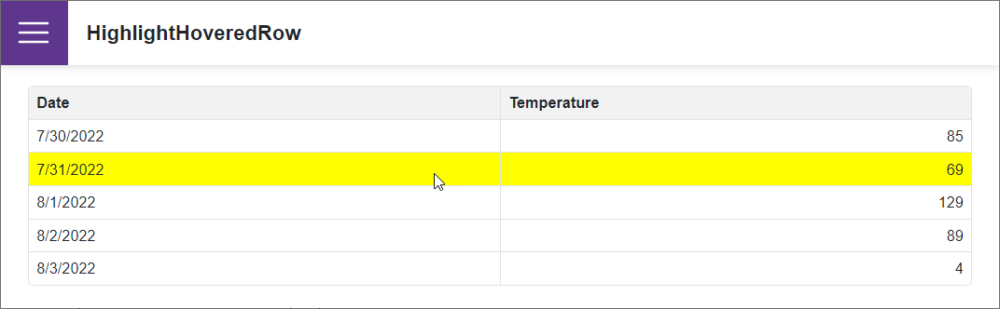

<!-- default badges list -->

<!-- default badges end -->
# Grid for Blazor - How to highlight a row on hover

This example highlights a Blazor Grid ([DxGrid](https://docs.devexpress.com/Blazor/403143/grid)) row when a user hovers over the row.

Our Blazor Grid's [CustomizeElement](https://docs.devexpress.com/Blazor/DevExpress.Blazor.DxGrid.CustomizeElement) event allows you to customize the [DxGrid](https://docs.devexpress.com/Blazor/403143/grid) rows and cells. This event's [ElementType](https://docs.devexpress.com/Blazor/DevExpress.Blazor.GridCustomizeElementEventArgs.ElementType) argument property gets the type associated with the processed element. Use the event's [CssClass](https://docs.devexpress.com/Blazor/DevExpress.Blazor.GridCustomizeElementEventArgs.CssClass) argument property to apply a CSS class to the processed element.

## Files to Review

- [Index.razor](./CS/HighlightHoveredRow/Pages/Index.razor)

## Documentation

- [Grid: Edit Data](https://docs.devexpress.com/Blazor/403454/grid/edit-data-and-validate-input)
- [Grid: Selection](https://docs.devexpress.com/Blazor/DevExpress.Blazor.DxGrid.SelectionMode)

## More Examples
 
- [Grid for Blazor - How to edit a row on a separate page](https://github.com/DevExpress-Examples/blazor-DxGrid-Separate-Edit-Form)
<!-- feedback -->
## Does this example address your development requirements/objectives?

 

(you will be redirected to DevExpress.com to submit your response)
<!-- feedback end -->
